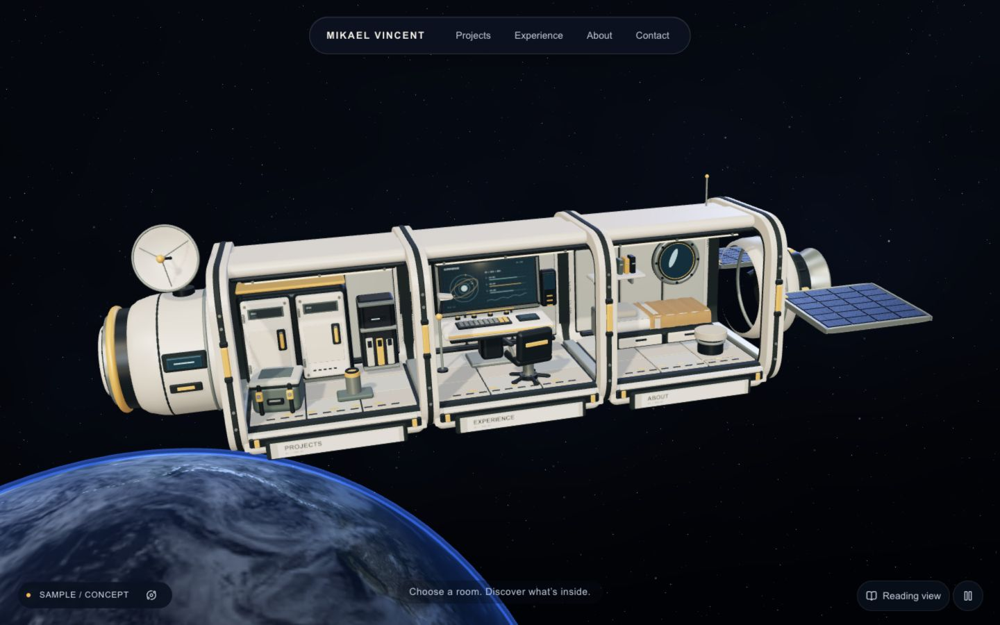
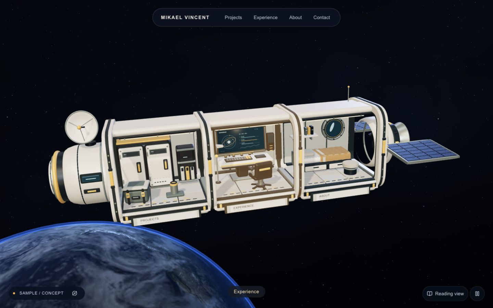
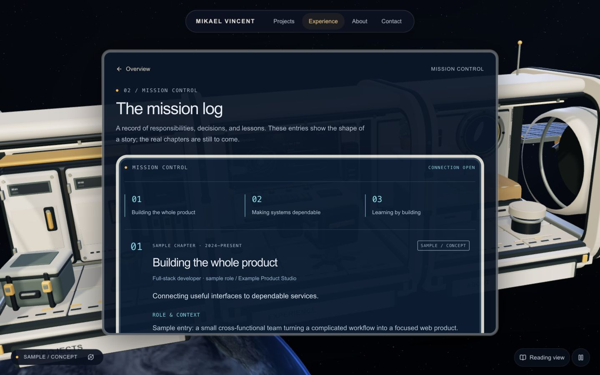
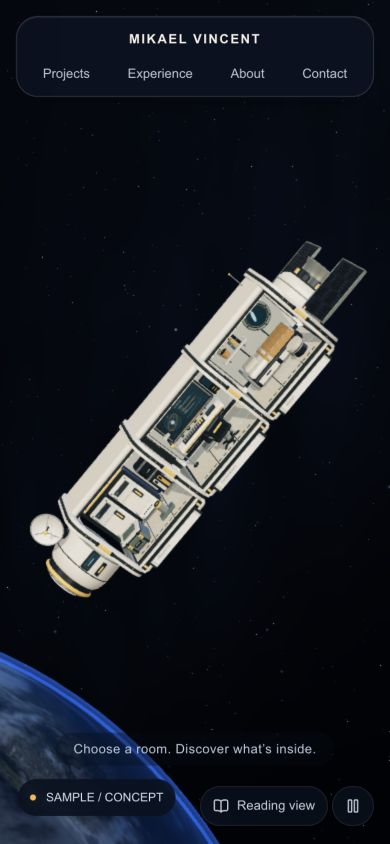
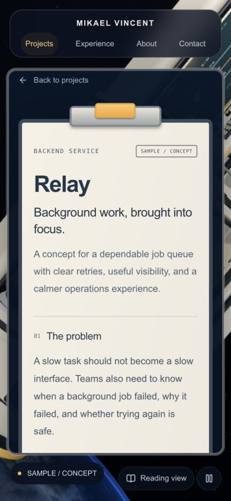

# Immersive revision validation

Validated 9 September 2026 on this Mac using the Codex browser and real local D1/R2 emulators. Final visual captures and production checks use the built Worker on loopback. This is local revision acceptance; the existing hosted sign-in callback incident is not represented as resolved.

## Evidence

- [15 passing tests](evidence/immersive/workflows.tap): database/admin/auth/contact/media/publishing/personalization coverage, fixed-flight bounds, route parsing (including private record IDs), and shared editable metadata.
- [TypeScript](evidence/immersive/typecheck.txt), [lint](evidence/immersive/lint.txt), [build](evidence/immersive/build.txt) and [dependency audit](evidence/immersive/dependency-audit.json): successful; zero reported dependency vulnerabilities.
- [Accessibility results](evidence/immersive/accessibility.json): six public views at 1440px, the same six at 390px, a 768px tablet view and real WebGL-loss fallback. Every scan reported zero WCAG A/AA violations; document width matched the viewport. Scans do not certify all accessibility behavior.
- [Production interactions](evidence/immersive/production-interactions.json): fixed quaternion and model rotation after dragging, whole-room hover, raycast entry, persistent renderer, instantaneous paused keyboard entry with reader focus, and mobile canvas selection. CPU measurements describe submission costs, not GPU timing.
- [Development interaction log](evidence/immersive/interactions.json): Back/Forward, dossier metadata, Escape, input focus across keyboard-sized resize, real context-loss recovery, readable navigation, and private ID-preview Back restoration. An earlier paused-focus failure is retained as diagnostic history; the production log proves the subsequent fix.
- [Production measurements](evidence/immersive/production-measurements.json): semantic HTML, one h1 per route, five warm full-response samples per route. Approximately 8–14 ms on loopback; compressed HTML about 10–11 KB. These are not field Core Web Vitals or network simulations.
- [Database restore](evidence/immersive/restore.json): portable draft/published records round-trip to new SQLite, excluding credentials and inbox data.

The desktop overview uses 94 steady draw calls and about 378,300 submitted triangles including Earth. The cached shadow pass runs on setup and responsive geometry changes. Mobile pixel ratio is capped; animation runs at most 30fps. Production excludes the audit and fault-injection UI.

## Visual record

Other room screenshots are in `evidence/immersive/`. Pointer/click, keyboard, history and fault behavior were exercised in the browser. Responsive viewports were inspected; physical phone GPU performance, screen-reader speech and OS-level reduced-motion toggling were not independently measured. Pause exercises the same renderer motion-disabled path; media-query/CSS handling was reviewed in source.

## Operation

The development server is intentionally left running at `http://localhost:3000` with sample content and the claimed local studio at `/admin`. If stopped later, `npm run dev` restarts it using persisted data. `npm start -- --port 4173` inspects the built Worker with the same local persistence directory. Its production bundle has no development sign-in simulator.

See [the independent critic report](CRITIC-REPORT.md) for final scores and limitations.
