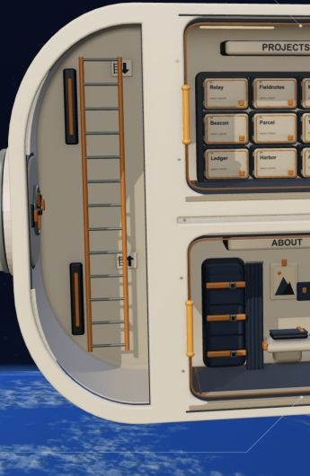
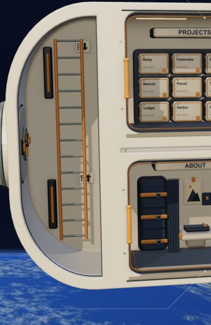

# Ladder shoulder lip correction

Scope: remove the raised sheet along the upper and lower curved inner edges of the ladder room, as annotated in the September 10 screenshot. No room furnishings, background, camera behavior or reading interfaces were changed.

## Exact cause and change

The remaining strip was the forward face and bevel of `walkway-curved-end-pressure-cap-exterior`. The old cap follows a smaller aperture than the continuous lining: near the docking tangent, its inner X edge is −0.61 instead of −0.665, before layout scale. Its forward face at Z≈1.21–1.228 projects ahead of the lining. Removing the old interior material bucket in an earlier revision did not remove these axial faces, which were classified as exterior.

The correction removes only those forward-facing triangles from both shoulder caps. The existing longitudinal hull, lining and common front chassis close the joint. No covering strip, padding or replacement sheet was added.

Baseline: commit `b6cd2c1`, model SHA-256 `edfabdd791027046a2aad9074ac41739e01d24c56f276ddca7db1b86b24e1fe1`.

Final model SHA-256: `052c89287d2dcebf943f7afb13c04972c334521a33ebafcf256d7fc3d4f01d26`.

## Direct visual inspection

| Before | After |
|---|---|
|  |  |

These are unedited browser screenshot clips from separate, freshly loaded renderers. Their camera position, quaternion, viewport, layout and drawing-buffer dimensions match; see [before pose](evidence/ladder-lip/before-pose.json) and [after pose](evidence/ladder-lip/after-pose.json). The raised cream slivers and their abrupt ends beside the central hatch are absent in the final view. The broad matte lining and narrow dark junction remain.

Full captures: [baseline](evidence/ladder-lip/before-overview-2560.jpg), [final](evidence/ladder-lip/after-overview-2560.jpg). Further final inspection: [first drag angle](evidence/ladder-lip/after-oblique-2560.jpg), [opposite angle](evidence/ladder-lip/after-opposite-oblique-2560.jpg), [390-pixel portrait](evidence/ladder-lip/after-portrait-390.jpg).

The first attempted hot-reload comparison retained its renderer and was discarded. Only fresh-renderer captures support this review. Whole-scene triangle counters include changing shooting stars; they are not used as exact mesh-removal counts.

## Validation and limits

The independent [actual-mesh comparison](evidence/ladder-lip/actual-mesh-audit.json) confirms exactly 386 removed triangles: 192 on the lower shoulder and 194 on the upper. All retained cap attributes match within 0.000001. The other 746 individual meshes are unchanged, as are all 748 individual transform/material records and 17 instanced assemblies in each layout.

Across 43,048 forward, tangency and oblique ray samples in both layouts, 223 old lip hits become zero. No baseline hit becomes a candidate miss. At the former lip positions, rays now reach the existing continuous liner or collar seal. Rays outside the silhouette can miss both models; this is not a claim that every grid ray hits the ship.

The critic also independently checked [source isolation and capture metadata](evidence/ladder-lip/critic-source-and-pose.json): reversing just the removal helper and its call restores the baseline model ignoring formatting.

Reproduce the actual-mesh comparison from the repository root (it takes a few minutes):

```sh
node docs/evidence/ladder-lip/actual-mesh-audit.mjs . git:b6cd2c1:components/spacecraft-model.ts /tmp/ladder-lip-audit.json
```

The [independent critic report](CRITIC-REPORT-LADDER-LIP.md) assesses this defect only. Both root and critic inspected the corrected GPU captures; the geometry comparison supplements that visual evidence. Finite geometry probes and a few camera poses do not certify every possible view.

Typecheck, repository lint and the Sites production build passed. Lint initially found an unused helper in the previous docking audit; that unused declaration was removed. Build warnings concern an upstream deprecated module API, bundle size, plugin timing and route classification. The development site remains running at `http://localhost:3000/`; this revision was not deployed.

The prior four-point interior review is preserved in [CRITIC-REPORT-PLAIN-INTERIORS.md](CRITIC-REPORT-PLAIN-INTERIORS.md). Its score is not used to validate this correction.
