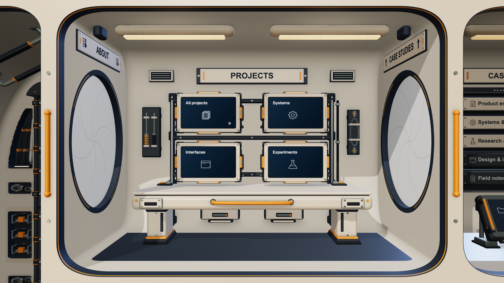

# Baked diffuse-lighting probe — 15 September 2026

Baseline: `6e689c2`. The owner approved retaining production GTAO after entry 22
and authorized candidate 5. This experiment changes no ordinary portfolio
lighting. Its controls, sample captures, fit and assets are developer-only.

## Bounded hypothesis

The current renderer already prepares a PMREM-filtered RoomEnvironment once,
and uses Three r185's precomputed DFG lookup. It does not calculate scene-wide
indirect bounce lighting on every frame. Three's physical shader also shares
its environment irradiance between diffuse and multiple-scattering specular
energy. Saving final material diffuse color would discard view-dependent energy
conservation and could bake room dimming twice.

The selected experiment approximates that **existing, already-filtered global
irradiance field** with nine RGB polynomial/SH2 coefficients. It is not a local
surface lightmap, new scene-bounce solution or replacement for contact shading.
It adds no geometry or persistent texture, avoiding entry 22's subdivision cost.
Projects remains the bounded target, based on the earlier room survey. All
three variants use the delivered geometry, GTAO and approved 8K Earth.

- **A:** original lighting.
- **B:** replace the roughness 1 PMREM irradiance lookup with the fitted probe.
  This changes both environment diffuse and the shared multiscattering energy.
  The original view-dependent specular radiance lookup remains.
- **C:** change only the environment diffuse contribution within
  `RE_IndirectSpecular_Physical`. The original irradiance lookup and specular
  multiscattering energy remain. This is the conservative visual control, not
  a claimed cheaper shader.

B can remove **one** hardware-bilinear PMREM fetch per affected fragment, replacing
it with polynomial arithmetic and coefficient access. C keeps that fetch and
adds the probe computation. Neither removes the main lighting loops, the three
directional/eight point lights, hemisphere light, shadow sampling, GTAO, DFG
calculations, reflection-direction/roughness calculations or PMREM allocation
and startup generation. The removed work must not be exaggerated as “baking all
lighting.” Diffuse and specular terms are replaced at their original accumulation
points, not added on top of the original diffuse term.

The probe is evaluated at the same current environment-rotated world normal as
Three, then multiplied by PI and the current environment intensity once. This
keeps portrait roll and changing surface normals live. Albedo, room dimming,
emission, neutral-cabin-paint hooks, material metalness/roughness and output color
management stay in their original paths. Emitted/printed surfaces, unsupported
materials, moving reader/door assemblies and invalid normals are excluded.
Eligible meshes share B/C clones according to their original material sharing;
scalar feedback is synchronized once per material. The lab does not claim that
108 coefficient bytes represent its complete additional memory.

## Fit, validation and asset cost

Final source freeze: `b005614a-4515-47c9-8493-107d2721cf37`.
`final-manifest.json` hashes source, compiled output, public assets and sampler;
`final-source.json.gz` retains all 85 non-dependency source inputs. The lockfile
identifies dependencies. The initial pilot's compiled bundle and manifest are
also retained; its per-mesh clone strategy, eligibility and missing held-out
validation were superseded, so it is not final performance evidence.

The developer capture reads 4,096 near-uniform unit directions from the actual
PMREM roughness 1 lobe into a Float32 target. An offline least-squares fit solves
nine basis terms `[1,x,y,z,xy,yz,3z²−1,xz,x²−y²]`, with conditioning and input-budget
checks. No second diffuse convolution is applied. A separate 4,096-direction set,
rotated by π/7, is excluded from the fit. The actual clamped Float32 probe shader
is read back and compared with actual PMREM samples at those held-out directions.
Raw directions, reference values and predictions are in each final visual report.

| Item | Measured or explicitly scoped value |
| --- | ---: |
| Training / held-out direction count | 4,096 / 4,096 |
| Training relative RMS error | 5.2906% per channel |
| Held-out GPU relative RMS error | 5.2901% per channel |
| Held-out maximum linear radiance error | 0.22588 per channel |
| Negative clamped GPU predictions | 0 |
| Fit computation | 4.535 ms, one developer observation |
| Asset JSON / gzip / offline Brotli | 2,026 / 952 / 776 bytes |
| Coefficient payload as Float32 | 108 bytes (27 numbers) |
| Additional geometry arrays / triangles / persistent texture | 0 / 0 / 0 |
| Eligible meshes / shared materials | 64 / 31 |
| Triangles covered by those meshes, including instances | 210,296, unchanged |

The source RoomEnvironment's sampled RGB channels are identical, hence the same
per-channel errors. Directional radiance error is not a percentage of final
screen-pixel error: other lighting and tone mapping also contribute. Clamping
and Float32 execution are included in held-out GPU results. Tests also verify
exact synthetic polynomial reconstruction and malformed/singular-input failures.

The final loopback developer request took 150.6 ms including GPU capture/export,
fit and compression. Fetching 952 bytes took 1.2 ms, decompression/text 0.3 ms, and JSON
parsing fell below the displayed timer resolution (recorded 0, not zero real work).
Installation including the developer-only held-out GPU validation took 85.6 ms;
84.7 ms of that was validation submission/readback. None is a cold visitor startup,
GPU-upload-only, real-network latency or steady-state speedup measurement.

Input SHA-256: `b2b8ba919c5c818aea8baa4ec6e007a5f3b1bd393aa66d92d00feaa811baaee5`.
Fitter SHA-256: `c37b9c1b7a9b9a056da4e1376f673ff12977966c2dee64c14e945811b9f97f14`.
Payload SHA-256: `5ca4d8ec037a663b193283d5e8d474884a5021711b802b851bf5d13ac4115d98`.
The descriptor also records compressed hashes. Source identity includes the
actual exported sample/validation data and capture provenance. This is not a
production cache-validity, asset-build or cross-GPU agreement system.

## Visual findings

The final wide idle comparison changes 1,588,362 pixels for B and 1,581,655 for C,
with a maximum channel difference 37/255. The changes are mainly subtle surface
brightness/shading differences; the room composition, text, silhouettes and
smooth contact shading are preserved. Neither is an exact/invisible replacement.
Static whole-room views cannot establish that B's specular-energy change is
perceptually absent. Approval is required before changing the normal site.

Before, delivered lighting:

After, candidate B (developer-only shared irradiance probe):

The fixture uses production-compiled React and the real spacecraft renderer with
public seed content and frozen background time. It is not the deployed Vinext
route or native Safari. Wide captures are 1280×720 CSS at DPR 2, yielding 2560×1440
originals, viewed at 2048×1152 in review. Portrait captures are actual 900×1200/DPR 1;
compact captures are actual 390×844/DPR 1. Canvas captures exclude the HTML reader
text and do not establish its full accessibility or legibility. The replay uses
controlled input events and fixed simulation steps; it is not a trusted native
input or complete reduced-motion test.

Each final layout passed 50 candidate comparisons: 150 total, all with WebGL
error 0 and pixel-exact A restoration. The set includes idle, four hover corners,
held drag and spring return, half/open/closed focused doors, reader transitions,
neighboring rooms, ladder travel and overview roll. B and C remain active at the
compact width even though production GTAO is disabled there. Idle B/C changed
371,069 / 369,405 pixels at 900×1200 (maximum 36/255), and 67,830 / 67,556 at
390×844 (maximum 12/255). Background/room lighting is never changed globally.
These checks establish safe restoration and finite tested states, not visual
equivalence across all possible inputs or devices.

## Rendering observations and rejection record

No other builds, tests or agent WebGL sessions ran during these timed windows.
The hidden Chromium 152 browser reports ANGLE Metal on Apple M4; AC power,
low-power mode off and nominal `ProcessInfo.thermalState` were recorded. The
conditions field was left blank: unrelated user/system workload and ambient
conditions were not controlled. Nominal pressure and a fixed pause do not prove
equal clocks, absence of throttling, measured temperatures or thermal causation.

A fresh Projects baseline retains four 90-frame pass-query windows. The rested
attempt then pauses rendering for 60 seconds and gathers three 120-frame A
controls with ten-second breaks. Their CPU means are 4.129 / 4.322 / 4.129 ms
(4.68% spread); GPU frame means are 15.662 / 16.657 / 16.327 ms (6.09% spread).
The GPU spread exceeds the predefined 5% limit, so **no candidate block is
accepted**. View/settings match and all GL checks are zero. Do not treat this
rejected attempt as an A/B speedup measurement.

The subsequent unranked survey records 24 × 120 frames in `A B C C B A` order
for idle/hover and separate frame/pass GPU query scopes. It is descriptive only;
it cannot repair the failed rested protocol. Values below are the two window
means or p95s in observation order, in milliseconds (no pooled percentile or
significance claim). CPU and GPU overlap and must not be added.

| Workload / variant | CPU mean | CPU p95 | GPU frame mean | GPU frame p95 | Frame interval mean / p95 |
| --- | --- | --- | --- | --- | --- |
| idle / A | 4.34 / 4.11 | 5.00 / 4.90 | 15.49 / 15.91 | 17.52 / 17.47 | 20.72 / 20.76; 24.50 / 24.50 |
| idle / B | 3.92 / 4.44 | 5.30 / 5.50 | 17.68 / 17.31 | 17.94 / 21.58 | 21.41 / 21.57; 25.60 / 25.70 |
| idle / C | 4.77 / 4.00 | 5.90 / 5.10 | 17.95 / 15.54 | 18.26 / 18.29 | 21.84 / 21.56; 25.90 / 25.90 |
| hover / A | 5.34 / 5.29 | 5.90 / 6.00 | 20.09 / 20.74 | 20.38 / 22.68 | 24.60 / 26.70; 26.10 / 28.60 |
| hover / B | 5.35 / 5.28 | 6.10 / 6.00 | 20.19 / 21.07 | 20.92 / 21.86 | 25.32 / 25.71; 26.90 / 27.70 |
| hover / C | 5.52 / 5.43 | 6.10 / 6.00 | 20.42 / 20.82 | 21.21 / 21.24 | 25.89 / 25.74; 26.80 / 27.30 |

The separately queried spacecraft pass observed idle GPU means A 16.51–20.57,
B 17.95–21.82, C 19.23–21.13 ms; hover A 21.73–21.86, B 22.67–25.02,
C 23.01–24.11 ms. Baseline variation grows during the survey: idle A CPU changes
from 4.64 to 6.16 ms and its spacecraft query from 16.51 to 20.57 ms. These ranges
are not attributed to the candidate, and no significance, speedup or slowdown
percentage is claimed. Pass-query timings on this engine include deferred GPU
work and query overhead; their phases are not additive per-feature invoices.
Use the independent whole-frame scope above for frame observations.

All variants retain 301 spacecraft draws / 881,084 triangles in measured views;
hover retains the 261-draw / 868,222-triangle AO refresh and one composite draw.
There are no measured-window GL errors. All raw frames, counters, query samples,
GPU availability/disjoint status, means/p95, camera/light state, power context and
material eligibility remain in compressed reports, indexed by `summary.json`.
No process/GPU memory, energy, battery, heat or native Safari benefit was measured.

## Verification and retained outcome

The full application suite passed **301 tests** (including seven fitter tests),
and the production build passed. The final developer-only finite/zero-reference
validation guard was followed by typecheck, affected lint and actual GPU/replay
validation; production code was unchanged after the full suite/build. Final
browser error logs were empty. The prior contact command is retained through a
thin wrapper around the shared replay; it compiled in the frozen lab, but its
expensive contact bake was not rerun for this diffuse task. The shared replay was
exercised by the final diffuse checks. Logs are retained losslessly as
`check-*.log.gz`. The independent review scored **95/100**, with no unresolved blockers for this
developer-only outcome; see [critic review](critic-review.md).

**Recommendation: keep the delivered illumination.** B is small but changes the
appearance/shared specular energy and establishes no repeatable benefit. C
preserves that energy but keeps the original lookup and adds arithmetic. The
production site therefore imports neither probe. The fitting/capture/replay
infrastructure is retained for future measured experiments, not enabled as a
visitor feature. Approval of the photos and repeatable net savings are needed
before integration. No broader lightmap or new ledger candidate was implemented.
