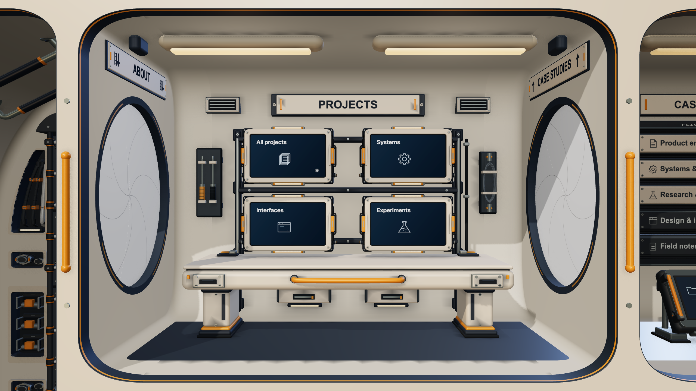

# Static contact-shading experiment — 15 September 2026

Baseline: `174ea8c`, with approved 8K Mediterranean night Earth and the existing
geometry-based GTAO invalidation rule. Candidate 4 was explicitly authorized.
Candidate 5 remains held. This directory preserves the developer experiment;
normal portfolio visits do not load a bake or its controls.
Implementation commit: `9e9aff0` (the final source freeze precedes this commit).

## Target and baseline

The forward/reverse four-room survey contains 16 windows of 90 frames: 1,440
measured frames, excluding preparation. Projects was chosen for its high selected
view workload (301 draws / 881,084 triangles) and the largest cabin-furniture
triangle group (146,396 triangles / 43 draws). About furniture has more draws
(53); shared chassis is larger overall (238,600 triangles / 10 draws). These are
not additive isolated GPU costs.

| Hover view | CPU mean range, ms | AO-refresh GPU query mean range, ms |
| --- | ---: | ---: |
| Projects | 4.65–4.72 | 13.75–13.93 |
| About | 4.68–4.75 | 12.91–13.22 |
| Case studies | 4.32–4.49 | 12.26–12.27 |
| Contact | 4.13–4.19 | 13.33–13.47 |

Ranges are two descriptive observations, not confidence intervals or a qualified
timing ranking. All eight idle windows reused AO for all 90 frames; all eight
hover windows refreshed it on every frame due to camera position/angle changes.
The targeted opportunity is camera-motion work, not idle recomputation.

Survey engine: hidden built-in Chromium 152 / ANGLE Metal Apple M4, Three r185.
Actual viewport 1280×720 CSS, 2560×1440 drawing buffer, DPR 2; AO 832×468,
32 AO and 32 denoise samples; 2048² cached key shadow. Earth is 8192×4096,
frozen at time zero. This is the actual application renderer and public seed
content in a production-compiled standalone fixture, not native Safari or the
deployed Vinext route. Per-row settings capture the initialized view.

There were 336 valid pass queries, with no skipped/disjoint/pending queries or
WebGL errors in this survey. Nevertheless, query attribution is uncertain:
the one-triangle AO composite reports nearly the same elapsed GPU time as the
preceding spacecraft/AO passes. GPU scheduling or tiled-renderer boundaries can
influence these observations. Do not sum the phases, interpret a 14ms composite
query as its isolated cost, or subtract them to infer a speedup. Separate
whole-frame query samples are needed for candidate conclusions.

Native endpoints reported nominal pressure, Low Power Mode off and an AC Power
source line; the battery separately reported 52%→50%, discharging. Neither an
AC label nor nominal OS pressure establishes charging, stable clocks or absence
of thermal throttling. Other user workload was uncontrolled.

## What is compared

- **A: delivered GTAO.** Original geometries/materials and original pass shaders.
- **B: baked static Projects receivers.** Geometric hemisphere visibility stored
  as byte vertex attributes, interpolated over subdivided surfaces and applied
  after color conversion with the existing 0.40 artistic strength. It is an
  approximation of contact shading, not a reconstruction of GTAO.
- **C: bake with live contact zones.** B outside expanded world-space bounds of
  the neighboring iris hatches and Projects reader; original GTAO remains active
  in those zones. Bake and live multiplication are mutually exclusive at each
  receiver pixel. The denoiser may still cross a mask boundary; this is not an
  exact dynamic fallback.

Both candidates keep the full-scene normal/depth pass. Receiver eligibility is
stored in its otherwise-unused alpha channel; masked static pixels return early
from the GTAO and denoise shaders. Displays, emitted light, printed symbols,
instances and other rooms remain live receivers. Moving geometry is absent from
the offline occluder set, but remains in the live normal/depth scene. B therefore
loses moving-object contacts onto baked static receivers. C attempts to retain
them locally. Neither removes the geometry pass or its two fullscreen draws.

Opaque neighboring geometry within the room bounds plus the contact radius is
retained as offline occluders. Broad receiver triangles are subdivided; outside
room triangles remain coarse and outside vertices are masked from baked shading.
Positions, UVs and normals are interpolated, so subdivision has its own visual
and geometry cost. A separate original-material/full-GTAO subdivision control
records that difference. Ray sampling, grazing-edge arithmetic, Uint8 storage
and interpolation can flatten detail or introduce gradients/seams.

The lab preserves material hooks and room color/emission feedback, collects hidden
readers for later deployment, checks payload structure, rejects unsupported
alpha/displacement/morph/draw-range inputs and follows the actual AO-enabled
capability/size policy. Selecting A restores original objects and shaders.
There is no production asset-validity system or automatic quality choice.

## Retained attempts and reproducibility

The initial two full bake attempts exceeded the 400,000-unique-sample guard before
any candidate could be rendered. Both failed reports are retained. The first
sampled cross-room shared geometry; the second restricted sampling to bounds but
still included other named room assemblies and excessive refinement. The first
input was not persisted before failure; its frontend source/bundle hashes and
error survive, but that exact backend input cannot be reconstructed from its
report alone. Subsequent inputs are persisted before baking.

The retained `sizing.json` compares edge limits without casting rays.
Filtering other named room assemblies, printed symbols and zero-normal gasket
receivers leaves 31 receivers (169,220 original triangles). A 0.10 world-unit
edge limit would produce 889,310 triangles / 495,047 unique samples, still over
the ray-sample guard. Limits 0.16 and 0.20 produce 483,032 and 396,302 triangles
respectively. The rendered prototype uses **0.16**, 32 rays and radius 0.32:
289,048 unique samples / 9,249,536 planned rays. This is a sizing decision, not
a proven image-equivalence or runtime-performance result. The sizing-only
placeholder output is explicitly refused by the renderer adapter.

Original zero-normal gasket vertices remain unchanged and live-shaded. The
experiment does not synthesize normals or alter their authored appearance.
The offline asset is stored compressed; subsequent developer requests may reuse
it only when both the exact exported input and baker-source hashes match.

Use the [diagnostics guide](../../../performance-diagnostics.md#offline-contact-shading-comparison)
for the lab controls and offline CLI. Reports carry their own frozen source,
bundle and public-asset hashes. Compare matching freezes and viewport settings;
do not treat a prototype sizing change as a production performance gain.

## Decision and measured asset costs

**Retain delivered GTAO.** Both baked variants visibly change the approved art.
The hybrid preserves more moving contacts, but introduces coarse, triangular
gradients around the header, ceiling fixtures, bench supports and floor edge.
This is not an appearance-preserving optimization. No candidate asset, shader,
quality change or automatic selection is enabled on ordinary portfolio visits.
The prototype remains available for a concrete before/after review; adopting a
different look requires the owner's approval. Candidate 5 remains held.

| Item | Delivered receivers | B / C prototype |
| --- | ---: | ---: |
| Receiver triangles | 169,220 | 483,032 (+313,812) |
| Retained receiver geometry arrays | 6,270,040 bytes | 14,386,010 bytes (+8,115,970) |
| Additional downloadable asset | None | 6,171,242 bytes gzip; 3,294,186 bytes measured offline Brotli |
| Decoded JSON transport | None | 55,024,311 bytes before parsing |
| Offline bake | None | 133.97 seconds, including 133.24 seconds of ray sampling |

The bake casts 9,249,536 rays against 309,134 nearby opaque triangles. It uses
31 receivers and 289,048 unique position/normal samples. The developer comparison
retains original and candidate geometries simultaneously for restoration; the
table's difference is not the lab's total residency. Array sizes and nominal
uploads are not measurements of process/GPU memory. JSON parsing adds transient
storage. Neither variant adds an AO texture target or removes the live targets.
The browser comparison fetched gzip; Brotli is the measured alternative encoding,
not a browser transfer measurement.

The original developer request took 176.08 seconds including export, bake and
compression. A subsequent loopback fetch took 2.8ms, decompression/text conversion
53.4ms, JSON parsing 45.6ms and validation/install submission 29.9ms. These are
individual development observations, not internet download, cold visitor startup
or GPU-upload timings. The original request reused the same source-identified
asset in later replays; its baking work is not incurred on each comparison.

Asset input SHA-256:
`3fa77f873c75245b4b93694bb96508a71084f73f4aabd3c8c0283ba659d88299`.
Baker SHA-256:
`66268b3cb87ff34880654391fc82c1ade35d00057267f9b568709660fa51138e`.
Payload SHA-256:
`90260d9e7526b9cbd8f3f998cbc446dcdbfe0d7e4e7c4370ba81d288582d61fa`.
The descriptor also records the gzip hash. Cache reuse checks the exact input,
baker and stored asset; it is a lab convenience, not a production rebuild policy.

## Final visual replay and verifier correction

Final source freeze: `38a41135-8427-4df8-9f7c-66f8656dc6da`.
`final-manifest.json` identifies source, compiled bundle and public asset hashes;
`final-source.json.gz` retains all 81 non-dependency input files. The lockfile
and manifest identify dependencies. The earlier `12c4d01d` archive is retained
as `pilot-manifest.json` / `pilot-source.json.gz`.

The final same-mount replay covers wide 1280×720 CSS / 2560×1440 buffer / DPR2,
portrait 900×1200 / DPR1 and compact 390×844 / DPR1, followed by a return to wide
for timings. Each visual run contains 46 candidate comparisons and a separate
subdivision-only control. All 138 candidate comparisons report WebGL error zero;
all 141 restoration checks return exactly to A. The compact policy disables AO,
so all 46 B/C comparisons fall back to A and match. Its subdivision-only
diagnostic is intentionally separate and changes 3,868 pixels; it is not a
compact-screen candidate optimization.

Wide idle B changes 1,351,527 pixels; C changes 948,786 (maximum channel difference
86/255). Subdivision alone changes 28,611 pixels (maximum 37/255), even with
original materials and full GTAO. These differences cannot be dismissed as just
the chosen AO strength. In the open reader view C changes 6,170 pixels, but its
closer match there does not establish equivalence elsewhere. The replay includes
four hover extremes, drag/release, half/open/closed doors, reader deployment,
ladder travel, neighboring cabins and overview. The live-zone count includes
the deployed reader. Captures contain the WebGL canvas, not the overlaid HTML
reader text; they do not establish a full reader accessibility/legibility audit.

Before (delivered GTAO):

After (C, baked surfaces with live door/reader zones; not enabled):

The first rested attempt correctly refused to rank timings because the saved AO
verification target retained its old dimensions after resize, leaving WebGL
error 1281. The shared developer verifier now resizes that backup before copying
and checks GL errors after every candidate image pair. This does not change
ordinary visitor rendering. The fresh responsive replay validates the fix.
Older image runs lack these per-pair GL checks; their images are retained as
pilot evidence, not final verified comparisons. Earlier shadow/geometry lab
records using the same resized verifier also did not establish this new GL
assurance; this does not automatically invalidate their candidate images.

The first successful pilot also used an unsupported Projects reader URL, so its
reader rows did not open the reader and are invalid for that claim. Later runs
use a published project slug and assert the reader's actual state. Failed bakes,
superseded runs and excluded timing controls remain available for inspection.

## Runtime observations and acceptance

The final rested attempt used a 60-second rendering break and three matched
120-frame A controls, separated by ten-second breaks. CPU means were
4.382 / 4.397 / 4.125ms (6.20% spread); whole-frame GPU query means were
18.627 / 16.713 / 14.659ms (23.74% spread, monotonic). It failed the documented
5% spread gate before any ranked candidate block. Camera/settings matched and
every GL check was zero. This is reference drift, not a diagnosis of throttling.
The preceding attempt was excluded for the verifier error described above.
Neither is presented as a successful ABBA/BAAB comparison.

A separate **unranked** A–B–C–C–B–A survey covered idle/hover with separate
whole-frame/pass-query captures: 24 windows × 120 frames = 2,880 measured frames,
excluding preparation. There were 432 valid GPU queries, no pending/skipped/
discarded samples and no GL errors. All idle windows cached AO for 120/120
frames; every hover window refreshed AO for 120/120 frames. No sample generated
the cached key shadow. Dynamic-zone bounds/material synchronization overhead is
included in candidate CPU observations.

| Whole-frame-query windows | CPU mean range, ms | GPU mean range, ms | Frame interval mean range, ms |
| --- | ---: | ---: | ---: |
| A idle | 4.27–4.32 | 16.00–18.30 | 20.99–21.75 |
| B idle | 6.81–7.21 | 25.96–26.18 | 32.01–32.03 |
| C idle | 6.48–7.36 | 25.72–26.18 | 31.81–32.45 |
| A hover | 5.92–9.80 | 22.49–39.82 | 27.59–46.30 |
| B hover | 9.24–12.43 | 33.89–48.56 | 41.65–60.57 |
| C hover | 11.60–12.26 | 40.75–47.69 | 50.91–60.10 |

These are two observed window means per cell, not error bars or a qualified
ranking. In particular, the A hover reference itself worsened from 22.49 to
39.82ms GPU. The figures do not establish the causal size of a slowdown, and
certainly do not establish an optimization gain. CPU, GPU and pacing are
separate measurements and must not be added. Per-window p95, frame traces,
pass queries and counts are preserved in the raw report and `summary.json`.
Eight GPU samples per frame-query window also limit tail conclusions.

Deterministic work counts explain why the hypothesis did not remove the main
geometry work: selected idle spacecraft draws remain 301, while triangles rise
from 881,084 to 1,194,896. During the controlled hover, the full normal/depth AO
refresh still averages 261.09 draws, with triangles rising from 868,225.85 to
1,182,037.85. Fractional counts are means across frames with slightly different
visible geometry. Sampling-mask early returns do not remove that pass. Pass GPU
attribution has the same limitation as the baseline survey; do not sum or
subtract those phase timings.

The final survey endpoints were nominal pressure, Low Power Mode off, AC Power;
battery state changed from 79% charging to 80% attached/not charging. Builds and
test processes were stopped for timing; other user workload was uncontrolled.
No clock, temperature, heat, energy or battery-saving measurement was made.
Results are built-in Chromium on this host, not native Safari or a universal
device ranking. A different UV-atlas bake could avoid subdivision but would be
a separate art/pipeline proposal, not a benefit established by this experiment.

## Verification and evidence index

- Full suite: **294 passed** (`check-tests.log.gz`), including 12 offline-baker
  tests for real geometry/contact/input-budget failure modes.
- Type checking and affected lint passed. The full suite preceded the final
  audit-backup resize fix; the final source was checked by typecheck, affected
  lint, a fresh production build and the complete responsive GL replay.
- Final production build passed (`check-final-build.log.gz`). Its existing Vinext
  route-classification notice is not a build failure.
- Source archive matches all 81 non-dependency manifest inputs. Restoring A
  returned zero pixel differences at every final checkpoint. Disposal restores
  original resources before freeing candidate-owned geometry/materials.
- Native Safari, a cross-GPU bake, real-network startup, trusted-input/complete
  accessibility testing and long-duration visitor battery/thermal behavior were
  not tested. Fixed simulation/seed fixtures are identified in every report.

[Raw run index](runs.md) links all 13 failed, pilot, final, excluded and unranked
reports, losslessly compressed with original PNG references intact.
[`summary.json`](summary.json) contains selected raw fields and uncompressed
report hashes. [Independent review](critic-review.md) records findings, revisions
and the final rubric/score. No authored design or visual candidate is shipped
as part of this evidence decision.

Check logs are also losslessly gzip-compressed, preserving the original tool output.
